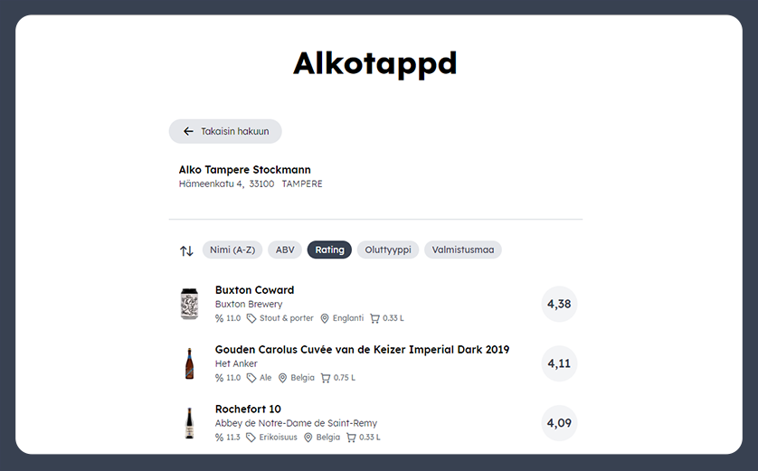

# Alkotappd

<div align="center">
  
  
  
  
  
</div>

[](https://github.com/penny-five/alkotappd/actions)

## What is this?

Application that combines beers in [Alko](https://alko.fi)'s catalog with their matching [Untappd](https://untappd.com) scores.



## Instructions

### How to setup project on Google Cloud

1. Create a new project on Google Cloud
2. Add Firebase (https://console.firebase.google.com/)
3. Enable Cloud Firestore API

### How to start local dev environment

1. Install dependencies

   ```sh
   yarn install
   ```

2. Login with Firebase

   ```sh
   yarn firebase:login
   ```

3. Set active Firebase project

   ```sh
   yarn firebase:use [project_id]
   ```

4. Init emulators

   ```sh
   yarn firebase:emulators:init
   ```

5. Start dev environment

   ```sh
   yarn dev
   ```

   This will do the following things:

   - Start Firebase emulator
   - Compile functions in watch mode
   - Start Vite dev server

   Open `http://localhost:8080` in browser.

### How to run tasks in local dev environment

1. Start local dev environment [as instructed](#how-to-start-local-dev-environment)

2. Start Firebase emulator functions shell

   ```sh
   yarn firebase:functions:shell
   ```

3. In functions shell run

   ```sh
   syncProducts();
   ```

   This will fetch all products from Alko catalog and add them to local Firestore.

4. In functions shell run

   ```sh
   updateRatings();
   ```

   This will fetch ratings for 30 beers and add them to local Firestore.

   **Be careful: Untappd API has a rate limit of 100 requests per hour and running this function once will consume 60% of that hourly quota.**

   `BATCH_SIZE` variable in `functions/src/tasks/update-ratings.ts` can be modified to use a smaller batch size, resulting in less requests.

### How to deploy to production

1. Install dependencies

   ```sh
   yarn install
   ```

2. Login with Firebase

   ```sh
   yarn firebase:login
   ```

3. Set active Firebase project

   ```sh
   yarn firebase:use [project_id]
   ```

4. Deploy

   ```sh
   yarn firebase:deploy
   ```

## License

MIT.
